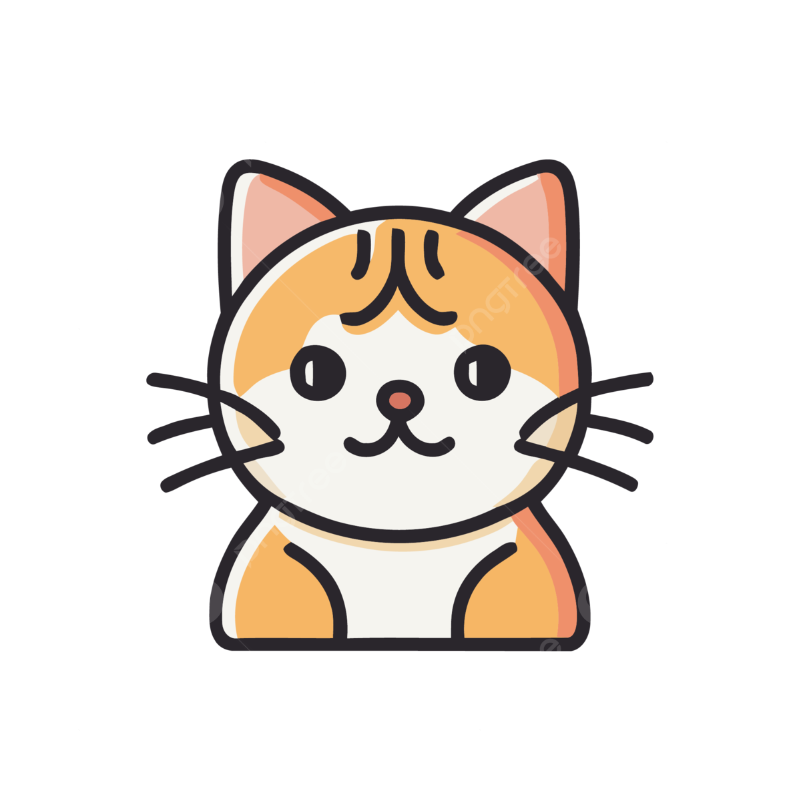

### <고양이 용품점 회원 관리 프로젝트>

#### **프로젝트 소개**
- vue.js로 고양이 용품점 사이트를 만들었습니다. 다음은 이 프로젝트에 대한 간단한 설명입니다.

####  **개발 기간**
- 2024.08.13 ~ 2024.08.20

####  **사용 언어**

  
####  **목적**
- 수업 시간에 배운 crud(create/read/update/delete) 실습. crud를 활용한 회원 관리 시스템 구축

####  **구조**
- 회원가입 / 로그인 / 게시판 / 마이페이지 / 장바구니 / 회원 관리 페이지 (관리자 페이지) 

####  **기능**
- 오라클과 서버를 연결하여 insert/select/update/delete를 각 2개씩 사용해 게시판과 회원 관리 시스템의 조회, 수정, 삭제, 생성 등을 구현하였습니다.
   

   
